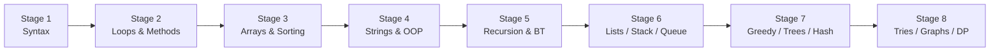

<div align="center">

# ☕ Java Programming DSA — Basic to Advanced

**A structured, hands-on roadmap for Java fundamentals, classical algorithms, and competitive-level data structures.**

[](https://openjdk.org/)
[](./29%20Dynamic%20Programming)
[](./Practices)
[](./LICENSE)

[About](#about) · [Quick Start](#quick-start) · [Roadmap](#learning-roadmap) · [Module Reference](#module-reference) · [Classical Problems](#classical-problems-index) · [Best Practices](#best-practices)

</div>

---

## About

This repository is a **structured learning archive** for Java and Data Structures & Algorithms (DSA). It walks from absolute basics—flowcharts, variables, and control flow—through classical interview problems and advanced topics including **greedy algorithms**, **trees**, **graphs**, **tries**, and **dynamic programming**.

| Attribute | Detail |
|---|---|
| **Default branch** | `master` |
| **Numbered modules** | `01`–`16`, then `18`–`29` (**folder `17` is intentionally absent**) |
| **Total `.java` files** | **293** programs across all modules |
| **Dependencies** | None — standard Java library only |
| **CI** | Every `.java` file is compile-checked on push via [GitHub Actions](./.github/workflows/java-ci.yml) (JDK 17) |

Each program is designed to be compiled and run on its own. Folder names match the original curriculum numbering; file names often use abbreviations (e.g. `Kadans.java`, `BreathFirstSearch.java`) — the [Module Reference](#module-reference) below maps each file to its topic.

### Curriculum gaps (documented)

| Topic | Status |
|---|---|
| **17 — Time & Space Complexity** | Referenced in older notes; **no folder exists** in this repo |
| **Segment Trees** | Mentioned in legacy curriculum; **not implemented** yet |
| **01 Flowcharts** | Contains `flowChart.ext` only — no Java source |
| **03 Operators** | Contains `operators.txt` only — reference notes, no Java source |

---

## Quick Start

### Prerequisites

- **JDK 17** (matches the repo CI pipeline; JDK 8+ may work for most files)
- Terminal: PowerShell, CMD, Bash, or Zsh
- Optional: VS Code / IntelliJ IDEA with Java support

```bash
java -version    # should report 17.x
javac -version
```

### Compile and run a single program

```bash
# From repository root
javac -encoding UTF-8 "08 Arrays/Kadans.java"
java -cp "08 Arrays" Kadans
```

**Windows PowerShell:**

```powershell
cd "08 Arrays"
javac -encoding UTF-8 Kadans.java
java Kadans
```

### Multi-class or nested packages

```bash
javac -encoding UTF-8 "19 LinkedLists/LinkedList.java"
java -cp "19 LinkedLists" LinkedList
```

### Compile all files locally (same as CI)

```bash
# Linux / macOS / Git Bash
find . -name "*.java" -not -path "./.git/*" | while read -r f; do
  mkdir -p out
  javac -encoding UTF-8 -d out "$f" || echo "FAILED: $f"
done
```

> **Note:** Some files are IDE scratch files (`tempCodeRunnerFile.java`) or stubs (`List.java`, `HeapsBT.java`). Skip them if compilation fails.

---

## Learning Roadmap

Eight progressive stages. Stages 1–5 cover language + paradigm fundamentals; Stages 6–8 cover data structures through DP.



---

### Stage 1 — Foundations and Java Syntax

| # | Module | Files | What you will learn |
|---|---|---|---|
| 01 | [Flowcharts](./01%20Flowcharts) | 0 Java | Visual flow design (`flowChart.ext`) |
| 02 | [Variables & Data Types](./02%20Variables%20%26%20Data%20Types) | 12 | I/O, primitives, `CircleArea`, `GST`, swapping |
| 03 | [Operators](./03%20Operators) | 0 Java | Operator reference (`operators.txt`) |
| 04 | [If Else Stmt](./04%20If%20Else%20Stmt) | 8 | Leap year, tax, greatest number, temperature |

---

### Stage 2 — Control Flow and Abstraction

| # | Module | Files | What you will learn |
|---|---|---|---|
| 05 | [Flow Control(Loops)](./05%20Flow%20Control(Loops)) | 16 | `for`/`while`/`do-while`, primes, factorial, reversal |
| 06 | [Patterns](./06%20Patterns) | 17 | Pyramids, diamond, Floyd's triangle, butterfly patterns |
| 07 | [Function&Methods](./07%20Function%26Methods) | 16 | Overloading, palindrome, bin↔dec, optimized primes |

Subfolder: [06 Patterns/Patterns Advances](./06%20Patterns/Patterns%20Advances) — advanced nested-loop patterns.

---

### Stage 3 — Arrays, Sorting, and Matrices

| # | Module | Files | What you will learn |
|---|---|---|---|
| 08 | [Arrays](./08%20Arrays) | 17 | Linear/binary search, Kadane's, rain water, stock, triplets |
| 09 | [Sorting Algorithms](./09%20Sorting%20Algorithms) | 7 | Bubble, selection, insertion, counting sort |
| 10 | [2D-Arrays](./10%202D-Arrays) | 8 | Spiral matrix, diagonal sum, transpose, matrix search |

---

### Stage 4 — Strings, Bits, and Object-Oriented Programming

| # | Module | Files | What you will learn |
|---|---|---|---|
| 11 | [Strings](./11%20Strings) | 13 | Palindrome, anagrams, compression, `StringBuilder` |
| 12 | [Bit Manipulation](./12%20Bit%20Manipulation) | 7 | XOR, set bits, fast exponentiation, bitwise swap |
| 13 | [Oops](./13%20Oops) | 12 | Inheritance, polymorphism, abstract classes, interfaces |

---

### Stage 5 — Recursion and Algorithmic Paradigms

| # | Module | Files | What you will learn |
|---|---|---|---|
| 14 | [Recursion](./14%20Recursion) | 13 | Subsequences, tiling, friend pairing, keypad combos |
| 15 | [Divide&Conquer](./15%20Divide%26Conquer) | 6 | Merge sort, quick sort, inversion count, majority element |
| 16 | [BackTracking](./16%20BackTracking) | 11 | N-Queens, Sudoku, rat in maze, permutations |

> **Gap:** Module **17** (Time & Space Complexity) is not present. Complexity guidance is in [Best Practices](#best-practices) below.

---

### Stage 6 — Linear Data Structures

| # | Module | Files | What you will learn |
|---|---|---|---|
| 18 | [ArrayLists](./18%20ArrayLists) | 13 | Pair sum, container with most water, monotonic check |
| 19 | [LinkedLists](./19%20LinkedLists) | 3 | Singly/doubly LL implementation, JCF linked list |
| 20 | [Stacks](./20%20Stacks) | 11 | Valid parentheses, NGE, stock span, histogram area |
| 21 | [Queues](./21%20Queues) | 11 | Circular queue, stack↔queue conversion, Deque |

Subfolders: [18 ArrayLists/collections](./18%20ArrayLists/collections)

---

### Stage 7 — Greedy, Trees, Heaps, and Hashing

| # | Module | Files | What you will learn |
|---|---|---|---|
| 22 | [Greedy Algorithms](./22%20Greedy%20Algorithms) | 8 | Activity selection, Indian coins, Chocola problem |
| 23 | [Binary Trees](./23%20Binary%20Trees) | 5 | Traversals, LCA, min distance, top view |
| 24 | [Binary Search Trees](./24%20Binary%20Search%20Trees) | 7 | BST, AVL, mirror/merge, largest BST subtree |
| 25 | [Heaps](./25%20Heaps) | 10 | Min/max heap, heap sort, sliding window maximum |
| 26 | [Hashing](./26%20Hashing) | 16 | Custom HashMap, subarray sum K, itinerary tickets |

Subfolder: [25 Heaps/PriorityQueues](./25%20Heaps/PriorityQueues)

---

### Stage 8 — Tries, Graphs, and Dynamic Programming

| # | Module | Files | What you will learn |
|---|---|---|---|
| 27 | [Tries](./27%20Tries) | 3 | Prefix tree, longest dictionary word |
| 28 | [Graphs](./28%20Graphs) | 18 | BFS/DFS, Dijkstra, Bellman-Ford, MST, topo sort |
| 29 | [Dynamic Programming](./29%20Dynamic%20Programming) | 20 | Catalan, knapsack, LCS/LIS, edit distance, MCM |

---

## Classical Problems Index

Quick lookup for the most cited interview and competitive-programming problems in this repo.

| Problem | Module | Source File | Technique |
|---|---|---|---|
| Kadane's Algorithm (max subarray) | [08 Arrays](./08%20Arrays) | `Kadans.java` | Linear scan |
| Trapping Rain Water | [08 Arrays](./08%20Arrays) | `TrappedRainWater.java` | Two pointers |
| Best Time to Buy/Sell Stock | [08 Arrays](./08%20Arrays) | `BuySellStock.java` | Single pass |
| Merge Sort / Quick Sort | [15 Divide&Conquer](./15%20Divide%26Conquer) | `MergeSort.java`, `QuickSort.java` | Divide & conquer |
| N-Queens | [16 BackTracking](./16%20BackTracking) | `NQueens.java` | Backtracking |
| Sudoku Solver | [16 BackTracking](./16%20BackTracking) | `SudokuSolver.java` | Constraint propagation |
| Valid Parentheses | [20 Stacks](./20%20Stacks) | `ValidParantheses.java` | Stack matching |
| Next Greater Element | [20 Stacks](./20%20Stacks) | `NextGreaterElemnt.java` | Monotonic stack |
| Largest Rectangle in Histogram | [20 Stacks](./20%20Stacks) | `MaxRectAreaInHistgrm.java` | Monotonic stack |
| Activity Selection | [22 Greedy Algorithms](./22%20Greedy%20Algorithms) | `ActivitySelection.java` | Greedy scheduling |
| **Indian Coin Change** | [22 Greedy Algorithms](./22%20Greedy%20Algorithms) | `IndianCoins.java` | Greedy (canonical coins) |
| **Chocola Problem** | [22 Greedy Algorithms](./22%20Greedy%20Algorithms) | `ChocolaProblem.java` | Greedy cutting |
| Fractional Knapsack | [22 Greedy Algorithms](./22%20Greedy%20Algorithms) | `MaxTotalValue.java` | Greedy by ratio |
| Lowest Common Ancestor | [23 Binary Trees](./23%20Binary%20Trees) | `LowestCommonAncestor.java` | Tree traversal |
| AVL Tree | [24 Binary Search Trees](./24%20Binary%20Search%20Trees) | `AVLTrees.java` | Self-balancing BST |
| Sliding Window Maximum | [25 Heaps](./25%20Heaps) | `SlidingWindowMax.java` | Deque / heap |
| Subarray Sum Equals K | [26 Hashing](./26%20Hashing) | `SubArraySumEqualsToK.java` | Prefix sum + HashMap |
| **Dijkstra's Algorithm** | [28 Graphs](./28%20Graphs) | `DijkstrasAlg.java` | Shortest path |
| Bellman-Ford | [28 Graphs](./28%20Graphs) | `BellmanFordAlgo.java` | Negative edges |
| Prim's / Kruskal's MST | [28 Graphs](./28%20Graphs) | `MSTPrimsAlgo.java`, `KruskalsAlgo.java` | Minimum spanning tree |
| Topological Sort | [28 Graphs](./28%20Graphs) | `TopologicalSorting.java`, `TopologicalSortBFS.java` | DFS / Kahn's BFS |
| Cheapest Flights with K Stops | [28 Graphs](./28%20Graphs) | `CheapestFlightWithKStops.java` | Modified Dijkstra |
| **Catalan Numbers** | [29 Dynamic Programming](./29%20Dynamic%20Programming) | `CatalansNumber.java` | DP / combinatorics |
| **0/1 & Unbounded Knapsack** | [29 Dynamic Programming](./29%20Dynamic%20Programming) | `KnapSack.java` | Tabulation |
| Coin Change (min coins) | [29 Dynamic Programming](./29%20Dynamic%20Programming) | `CoinChange.java` | Unbounded knapsack |
| Longest Common Subsequence | [29 Dynamic Programming](./29%20Dynamic%20Programming) | `LongestCommonSubsequence.java` | 2D DP |
| Edit Distance | [29 Dynamic Programming](./29%20Dynamic%20Programming) | `EditDistances.java` | String DP |
| Matrix Chain Multiplication | [29 Dynamic Programming](./29%20Dynamic%20Programming) | `MatrixChainMultiplication.java` | Interval DP |
| Wildcard Matching | [29 Dynamic Programming](./29%20Dynamic%20Programming) | `WildcardMatching.java` | Pattern DP |

---

## Module Reference

Expand any module to see **every source file** and what it covers. All paths are relative to the repository root.

<details>
<summary><strong>01 Flowcharts</strong> — 0 Java files</summary>

| File | Description |
|---|---|
| `flowChart.ext` | Flowchart diagram source (non-Java) |

</details>

<details>
<summary><strong>02 Variables & Data Types</strong> — 12 files</summary>

| File | Description |
|---|---|
| `JavaBasics.java` | First program structure, `main` method |
| `Variables.java` | Variable declaration and assignment |
| `DataType.java` | Primitive and reference types |
| `Input.java` | Scanner-based user input |
| `sum.java` / `inputSum.java` | Basic arithmetic |
| `Avg.java` | Average calculation |
| `CircleArea.java` / `SquareArea.java` | Geometry formulas |
| `GST.java` | Tax/GST calculation |
| `FloatProdct.java` | Floating-point multiplication |
| `swapTwo.java` | Swap two numbers |

</details>

<details>
<summary><strong>03 Operators</strong> — reference only</summary>

| File | Description |
|---|---|
| `operators.txt` | Arithmetic, relational, logical operator notes |

</details>

<details>
<summary><strong>04 If Else Stmt</strong> — 8 files</summary>

| File | Description |
|---|---|
| `GreatestNo.java` | Greatest of two/three numbers |
| `LeapYear.java` / `LeapYearII.java` | Leap year conditions |
| `PositiveNo.java` | Positive/negative check |
| `TaxCalculator.java` | Income tax slabs |
| `Temp.java` | Temperature conversion |
| `Weeks.java` | Day-of-week logic |
| `xyValue.java` | Conditional expression demo |

</details>

<details>
<summary><strong>05 Flow Control(Loops)</strong> — 16 files</summary>

| File | Description |
|---|---|
| `forLoop.java` / `WhileL.java` / `DoWhileL.java` | Loop constructs |
| `breakL.java` / `ContinueL.java` | Loop control |
| `factorial.java` | Factorial computation |
| `Prime.java` | Prime number check |
| `ReverseNum.java` / `ReverseGivenNum.java` | Digit reversal |
| `MulTable.java` / `TenMul.java` / `TenMulNot.java` | Multiplication tables |
| `NaturalNumSum.java` / `EvenOddSum.java` | Summation patterns |
| `Square.java` / `NoPrinting.java` | Number printing |

</details>

<details>
<summary><strong>06 Patterns</strong> — 17 Java files</summary>

**Root**

| File | Description |
|---|---|
| `HalfPyramid.java` / `lTri.java` / `RTri.java` / `InverRTri.java` | Triangle patterns |
| `charterPatter.java` | Character pyramid |

**[Patterns Advances](./06%20Patterns/Patterns%20Advances)**

| File | Description |
|---|---|
| `ButterFlyPatt.java` | Butterfly pattern |
| `DimondPatt.java` | Diamond pattern |
| `FloydsTriangle.java` | Floyd's triangle |
| `HollowRect.java` / `HollowRhombus.java` / `SolidRhombus.java` | Hollow/solid shapes |
| `NumPyramid.java` / `PalindromicPattern.java` | Number pyramids |
| `ZeroOneTri.java` | 0-1 triangle |
| `X.java` | X pattern |
| `InvHalfWiNums.java` / `InverRotdHalfPyramid.java` | Inverted pyramids |

</details>

<details>
<summary><strong>07 Function&Methods</strong> — 16 files</summary>

| File | Description |
|---|---|
| `helloWorld.java` | Method basics |
| `calculateSum.java` / `Averg.java` / `product.java` | Return values |
| `Factorial.java` / `prime.java` / `PrimeOptimize.java` | Math utilities |
| `Palindrome.java` | Number palindrome |
| `BinToDec.java` / `DecToBin.java` | Base conversion |
| `DigitSum.java` | Sum of digits |
| `FuctionOverloading.java` / `functionOverloading2.java` | Method overloading |
| `SwapValue.java` / `even.java` | Parameter passing |

</details>

<details>
<summary><strong>08 Arrays</strong> — 17 files</summary>

| File | Description |
|---|---|
| `InputOutput.java` | Array I/O |
| `LinearSearch.java` / `binarySearch.java` / `StrLinSearch.java` | Search algorithms |
| `GetLargest.java` / `ReverseArr.java` | Basic operations |
| `Kadans.java` / `MaxSubArrSum.java` | Kadane's algorithm |
| `TrappedRainWater.java` | Trapping rain water |
| `BuySellStock.java` | Stock profit |
| `TripletsArr.java` / `NoTriplets.java` / `pairsArr.java` | Pair/triplet problems |
| `subArray.java` | Subarray enumeration |
| `RepeatedElement.java` | Duplicate detection |
| `AssigmntQ2S.java` | Assignment problems |
| `argument.java` | Command-line args |

</details>

<details>
<summary><strong>09 Sorting Algorithms</strong> — 7 files</summary>

| File | Description |
|---|---|
| `BubbleS.java` | Bubble sort |
| `selectionS.java` | Selection sort |
| `InsertionS.java` | Insertion sort |
| `countingS.java` | Counting sort |
| `InBuildSort.java` / `InbuildReverse.java` | `Arrays.sort` usage |
| `AssigmentQues.java` | Combined assignment |

</details>

<details>
<summary><strong>10 2D-Arrays</strong> — 8 files</summary>

| File | Description |
|---|---|
| `Creating2DArr.java` | 2D array basics |
| `SpiralMatrix.java` | Spiral traversal |
| `DiagonalSum.java` | Diagonal sum |
| `Transpose.java` | Matrix transpose |
| `Search2DElemnt.java` / `SearchInSortedMatrix.java` | Matrix search |
| `SumRowElemnt.java` | Row-wise sum |
| `TimesANumRepeat.java` | Element frequency |

</details>

<details>
<summary><strong>11 Strings</strong> — 13 files</summary>

| File | Description |
|---|---|
| `charAt.java` | Character access |
| `Palindromestring.java` | String palindrome |
| `Anagrams.java` | Anagram check |
| `StrCompress.java` / `StringCompression.java` | Run-length compression |
| `SubString.java` | Substring extraction |
| `LexicoGraphical.java` | Lexicographic order |
| `StringComparison.java` / `StringAssig.java` | Comparison & assignment |
| `stringBuilder.java` | `StringBuilder` usage |
| `upperCase.java` / `vowelCount.java` | Character processing |
| `FourDirection.java` | Directional string parsing |

</details>

<details>
<summary><strong>12 Bit Manipulation</strong> — 7 files</summary>

| File | Description |
|---|---|
| `BitWiseOperator.java` / `Operations.java` | AND, OR, XOR, shifts |
| `EvenOdd.java` | Parity via bitmask |
| `CountSetBits.java` | Brian Kernighan's algorithm |
| `FastExponentiation.java` | Binary exponentiation |
| `Swap.java` | XOR swap |
| `UpperCaseToLower.java` | Case conversion via bits |

</details>

<details>
<summary><strong>13 Oops</strong> — 12 files</summary>

| File | Description |
|---|---|
| `ClassesObjects.java` | Class and object basics |
| `Constructor.java` | Constructors and chaining |
| `Inheritances.java` / `MultipleInheritances.java` | Inheritance (interfaces for multiple) |
| `MethodOverloading.java` / `MethodOverriding.java` | Polymorphism |
| `AbstractClass.java` / `Interfaces.java` | Abstraction |
| `StaticKeyW.java` / `SuperKeyW.java` | `static` and `super` |
| `ComplexCalc.java` | OOP calculator |
| `Assigment.java` | Assignment demo |

</details>

<details>
<summary><strong>14 Recursion</strong> — 13 files</summary>

| File | Description |
|---|---|
| `RecursionBasic.java` / `RecursionBasicAssig.java` | Factorial, Fibonacci, power |
| `AllSubSequences.java` / `UniqeSubSequns.java` | Subsequence generation |
| `FriendsPairing.java` | Friend pairing problem |
| `TilingProblm.java` | 2×1 domino tiling |
| `KeyPadCom.java` | Phone keypad combinations |
| `PrintBinaryString.java` | Binary strings without consecutive 1s |
| `ReverseString.java` / `RemoveDuplicate.java` / `MoveAllX.java` | String recursion |
| `IsArrSorted.java` | Sorted array check |
| `FirstLstOcrencs.java` | First/last occurrence |

</details>

<details>
<summary><strong>15 Divide&Conquer</strong> — 6 files</summary>

| File | Description |
|---|---|
| `MergeSort.java` | Merge sort |
| `QuickSort.java` | Quick sort |
| `InversionCount.java` | Inversion count via merge sort |
| `RotatedSortSearch.java` | Search in rotated sorted array |
| `MajorityElemnts.java` | Majority element |
| `MStOnArrOStr.java` | Merge sort on strings |

</details>

<details>
<summary><strong>16 BackTracking</strong> — 11 files</summary>

| File | Description |
|---|---|
| `NQueens.java` / `NQueenPrintOneSol.java` / `NQueenTotCont.java` | N-Queens variants |
| `NKnights.java` | N-Knights problem |
| `RatInMaze.java` | Rat in a maze |
| `SudokuSolver.java` | Sudoku solver |
| `Permutation.java` / `SubSequences.java` | Permutations & subsets |
| `GridWays.java` | Grid path counting |
| `KeypadComb.java` | Keypad combinations |
| `BTonArr.java` | Backtracking on arrays |

</details>

<details>
<summary><strong>18 ArrayLists</strong> — 13 files</summary>

| File | Description |
|---|---|
| `Operations.java` | ArrayList CRUD |
| `MaxInArrList.java` / `ReverseList.java` / `SwapArrList.java` | List operations |
| `SortArrLst.java` | Sorting ArrayList |
| `PairSum.java` | Two-sum (two-pointer on sorted list) |
| `ContainerWMostWatr.java` | Container with most water |
| `MonotonicIncDes.java` | Monotonic array check |
| `LonelyNum.java` / `MostFrequent.java` | Frequency problems |
| `BeatifulArray.java` | Beautiful array construction |
| `MultiDimsArrLst.java` | Multi-dimensional ArrayList |
| `collections/sort.java` | JCF `Collections.sort` |

</details>

<details>
<summary><strong>19 LinkedLists</strong> — 3 files</summary>

| File | Description |
|---|---|
| `LinkedList.java` | Full singly linked list (add, remove, search, reverse) |
| `DoublyLinkedList.java` | Doubly linked list |
| `LLinJCF.java` | Java `LinkedList` from Collections Framework |

</details>

<details>
<summary><strong>20 Stacks</strong> — 11 files</summary>

| File | Description |
|---|---|
| `stacksUsingArrayList.java` / `stacksUsingLinkedList.java` / `StacksUseJCF.java` | Stack implementations |
| `ValidParantheses.java` | Balanced parentheses |
| `NextGreaterElemnt.java` | Next greater element |
| `StockSpanProb.java` | Stock span problem |
| `MaxRectAreaInHistgrm.java` | Largest rectangle in histogram |
| `DuplicateParantheses.java` | Duplicate parentheses detection |
| `ReverseStr.java` | String reversal via stack |
| `pushAtBotmInS.java` | Push at bottom of stack |

</details>

<details>
<summary><strong>21 Queues</strong> — 11 files</summary>

| File | Description |
|---|---|
| `QUsingArray.java` / `QusingLinkedList.java` | Queue implementations |
| `CircularQueueUseArray.java` | Circular queue |
| `QusingTwoStack.java` / `StackUsingTwoQueue.java` | Stack-queue interconversion |
| `StackandQueueUsingDeque.java` / `QueueJCF.java` | Deque and JCF queue |
| `NonReaptintLetterOfStream.java` | First non-repeating character |
| `InterLeaveTwoHalfOfQueue.java` | Interleave queue halves |
| `ReverseQueue.java` | Queue reversal |

</details>

<details>
<summary><strong>22 Greedy Algorithms</strong> — 8 files</summary>

| File | Description |
|---|---|
| `ActivitySelection.java` / `ActivityCodeForUnsorted.java` | Activity selection |
| `JobSequencingProblem.java` | Job sequencing with deadlines |
| `MaxTotalValue.java` | Fractional knapsack |
| `IndianCoins.java` | Indian denomination coin change (greedy) |
| `ChocolaProblem.java` | Chocolate bar cutting (minimum cost) |
| `MaxLenChainPairs.java` | Longest chain of pairs |
| `MinAbsoluteDiff.java` | Minimum absolute difference pair |

</details>

<details>
<summary><strong>23 Binary Trees</strong> — 5 files</summary>

| File | Description |
|---|---|
| `BinaryTrees.java` | Tree structure and traversals |
| `BuildBinaryTreeCode.java` | Level-order construction |
| `LowestCommonAncestor.java` | LCA of two nodes |
| `MinDistance.java` | Minimum distance between nodes |
| `TopViewOfTree.java` | Top view of binary tree |

</details>

<details>
<summary><strong>24 Binary Search Trees</strong> — 7 files</summary>

| File | Description |
|---|---|
| `BST.java` | BST insert, search, delete |
| `AVLTrees.java` | AVL self-balancing tree |
| `MirrorBST.java` | Mirror/invert BST |
| `MergeBST.java` | Merge two BSTs |
| `LargestBST.java` | Largest BST in binary tree |
| `SortedArrToBalancedBST.java` | Sorted array → balanced BST |
| `ConvertBSTtoBalncedBST.java` | Unbalanced BST → balanced |

</details>

<details>
<summary><strong>25 Heaps</strong> — 10 files</summary>

| File | Description |
|---|---|
| `minHeap.java` / `maxHeap.java` | Heap implementation |
| `HeapSort.java` | Heap sort |
| `ConnectNRopes.java` | Connect ropes (min cost) |
| `SlidingWindowMax.java` | Sliding window maximum |
| `WeakestSoldier.java` | K weakest rows in matrix |
| `NearestToOrigin.java` | K closest points to origin |
| `PriorityQueues/PriorityQueueInJCF.java` | JCF `PriorityQueue` |
| `PriorityQueues/PQforObjects.java` | PQ with custom objects |

</details>

<details>
<summary><strong>26 Hashing</strong> — 16 files</summary>

| File | Description |
|---|---|
| `HashMapImplementation.java` | Custom HashMap from scratch |
| `HashMapOperation.java` / `HashSetOperation.java` | JCF HashMap/HashSet |
| `LinkedHashMapB.java` / `LinkedHasSetOp.java` | Linked hash structures |
| `TreeMapB.java` / `TreeSetOp.java` | Sorted map/set |
| `Anagrams.java` / `MajorityElement.java` | Frequency problems |
| `SubArraySumEqualsToK.java` / `LargestSubArrSumWithZero.java` | Prefix sum hashing |
| `UnionIntersetionOfArr.java` | Set union/intersection |
| `TicketsItinerary.java` | Reconstruct itinerary |
| `ElemntCount.java` / `IterationOnHashMap.java` / `SetsIteration.java` | Iteration utilities |

</details>

<details>
<summary><strong>27 Tries</strong> — 3 files</summary>

| File | Description |
|---|---|
| `CreateATries.java` | Trie node structure and insert/search |
| `PrefixProblem.java` | Prefix uniqueness |
| `LongestWordInDictiionary.java` | Longest word from dictionary |

</details>

<details>
<summary><strong>28 Graphs</strong> — 18 files</summary>

| File | Description |
|---|---|
| `CreatingAGraph.java` | Adjacency list representation |
| `BreathFirstSearch.java` | BFS traversal |
| `DepthFirstSearch.java` | DFS traversal |
| `TopologicalSorting.java` / `TopologicalSortBFS.java` | Topological sort (DFS & Kahn's) |
| `DirectedGrpCycle.java` / `UndirectedGrpCycle.java` | Cycle detection |
| `BipartiteGraph.java` | Bipartite check |
| `FloodFillAlgo.java` | Flood fill |
| `DijkstrasAlg.java` | Dijkstra shortest path |
| `BellmanFordAlgo.java` | Bellman-Ford |
| `MSTPrimsAlgo.java` / `KruskalsAlgo.java` | Minimum spanning tree |
| `DisjointSetDS.java` | Union-Find for Kruskal's |
| `AllPathSrcTDest.java` | All paths source → destination |
| `CheapestFlightWithKStops.java` | Cheapest flight with at most K stops |
| `ConnectingCitiesWMinCost.java` | Min cost to connect cities |

</details>

<details>
<summary><strong>29 Dynamic Programming</strong> — 20 files</summary>

| File | Description |
|---|---|
| `FibonaciDP.java` | Fibonacci — memoization & tabulation |
| `ClimbingStaires.java` | Climbing stairs |
| `MinJumps.java` | Minimum jumps to end |
| `CatalansNumber.java` | Catalan numbers |
| `CountBSTs.java` / `MountainRanges.java` | Catalan applications |
| `RodCutting.java` | Rod cutting maximization |
| `CoinChange.java` | Minimum coins |
| `KnapSack.java` | 0/1, unbounded, space-optimized knapsack |
| `TargetSubSetSum.java` / `MinPartitioning.java` | Subset sum / partition |
| `LongestCommonSubsequence.java` / `LongestCommonSubString.java` | LCS / LC substring |
| `LongestIncreasingSubSequences.java` | LIS |
| `EditDistances.java` | Edit distance (Levenshtein) |
| `StringConversion.java` | String transformation min ops |
| `WildcardMatching.java` | `?` and `*` pattern matching |
| `MatrixChainMultiplication.java` | Matrix chain multiplication |
| `MonotonicStack.java` | Monotonic stack DP patterns |

</details>

<details>
<summary><strong>Practices</strong> — 5 Java files</summary>

| File | Description |
|---|---|
| `GreatestOfThree.java` | Greatest of three numbers |
| `Vowel_Consonant.java` | Vowel/consonant classification |
| `AnnualDay.java` | Annual day logic |
| `probability.java` | Basic probability |
| `practise.java` | General practice |

</details>

---

## Best Practices

### Time and space complexity

| Notation | Meaning | Example in this repo |
|---|---|---|
| O(1) | Constant | HashMap get — [26 Hashing](./26%20Hashing) |
| O(log n) | Logarithmic | Binary search — `binarySearch.java` |
| O(n) | Linear | Kadane's — `Kadans.java` |
| O(n log n) | Linearithmic | Merge sort — `MergeSort.java` |
| O(n²) | Quadratic | Nested loop patterns — [06 Patterns](./06%20Patterns) |
| O(2ⁿ) | Exponential | Naive subsets — `AllSubSequences.java` |

**How to analyze:** identify the outermost loop or recursion depth that scales with input `n`, then account for inner work per step.

### Clean code

1. One responsibility per method — separate I/O, logic, and printing.
2. Use descriptive names in your own solutions (repo files use short names for learning speed).
3. Extract magic numbers into `final` constants.
4. Handle edge cases first: empty input, single element, negatives.
5. Prefer `StringBuilder` over `+` concatenation in loops.

### Recursive debugging

When working in [14 Recursion](./14%20Recursion) or [16 BackTracking](./16%20BackTracking):

1. Write the **base case** explicitly.
2. Define the **smaller subproblem** the recursive call solves.
3. Trace `n = 3` by hand before running code.
4. Add entry/exit prints to visualize the call stack:

```java
static int factorial(int n) {
    System.out.println("  enter factorial(" + n + ")");
    if (n == 0) return 1;
    int result = n * factorial(n - 1);
    System.out.println("  exit  factorial(" + n + ") = " + result);
    return result;
}
```

### Suggested study loop

```
Concept → trace by hand → read source → run → modify input → re-solve from scratch
```

---

## Repository Structure

```
java_dsa/
├── .github/workflows/java-ci.yml   # Compile-all CI (JDK 17)
├── 01 Flowcharts/                    … 16 BackTracking/
├── 18 ArrayLists/                    … 29 Dynamic Programming/
├── Practices/                        # Warm-up problems
├── CODE_OF_CONDUCT.md
├── LICENSE
└── README.md
```

**Subfolders**

| Path | Contents |
|---|---|
| [06 Patterns/Patterns Advances](./06%20Patterns/Patterns%20Advances) | Advanced pattern programs |
| [18 ArrayLists/collections](./18%20ArrayLists/collections) | JCF sorting demo |
| [25 Heaps/PriorityQueues](./25%20Heaps/PriorityQueues) | Priority queue examples |

**Numbering note:** Folders jump from `16` → `18` because module `17` (Time & Space Complexity) was never added to this repository.

---

## Continuous Integration

The workflow at [`.github/workflows/java-ci.yml`](./.github/workflows/java-ci.yml) runs on every push and pull request to `master`:

1. Checks out the repository
2. Sets up **Temurin JDK 17**
3. Finds every `.java` file and compiles each individually into `out/`
4. Fails the build if any file does not compile

---

## Contributing

1. Fork the repository
2. Create a branch: `git checkout -b feature/your-topic`
3. Add or fix a `.java` file inside the appropriate numbered folder
4. Verify it compiles: `javac -encoding UTF-8 path/to/File.java`
5. Open a Pull Request against `master`

Keep file names consistent with the existing style and ensure each program has a `main` method where applicable.

---

## License

This project is licensed under the [MIT License](./LICENSE).

---

<div align="center">

**Built with persistence and many cups of coffee.**

If this repository helps your DSA journey, consider starring it on [GitHub](https://github.com/isinghabhishek/java_dsa).

</div>

---
